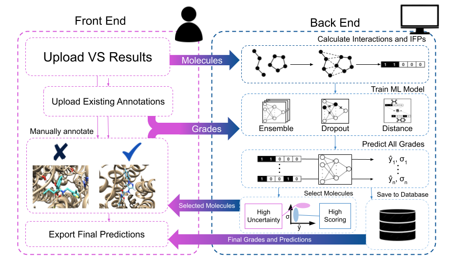
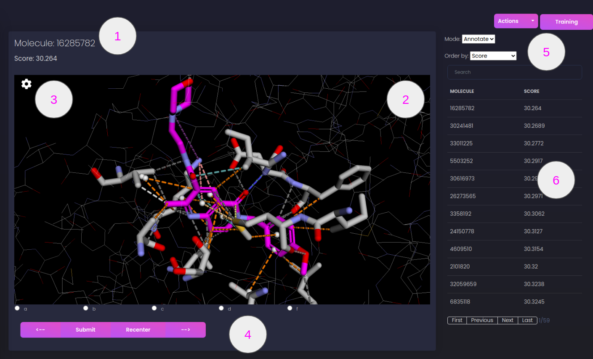
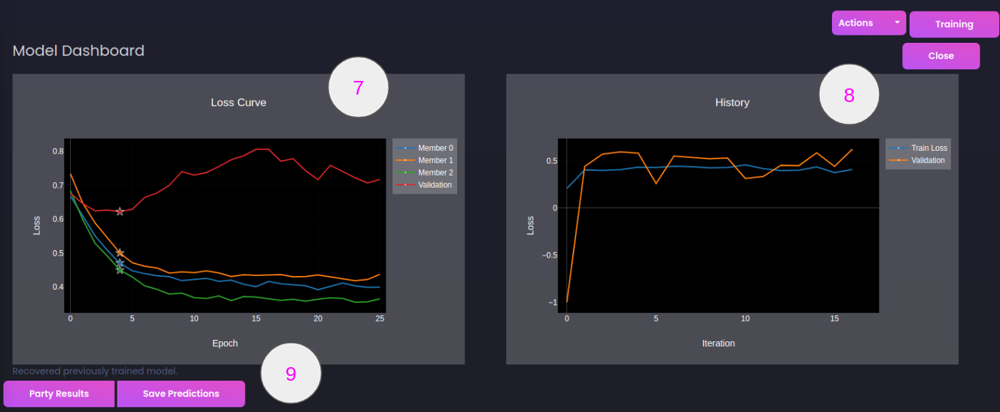

# Autoparty:  Machine Learning-Guided Visual Inspection of Molecular Docking Results



Autoparty is a Python-based application developed to assist scientists in analyzing the results of virtual docking screens using active deep learning. The user can upload the protein target and docked ligands to visualize their structure and relevant intermolecular interactions. These molecules can then be graded by the user and saved to a database to maintain a robust record of structures and human annotations. During human-in-the-loop training, a machine learning model is trained to both predict these annotations for new molecules and to determine which molecules are the most informative for the user to see, after which the model predictions can be exported for further review. We hope that this tool will bring together recent ML advancements and medicinal chemical expertise, facilitating easier pose evaluation and potentially allowing for the recovery of false negatives further down in the screening hit list.


---

## Installation

To run from the singlularity container:

1. Download the redis and Autoparty containers from [gdrive](https://drive.google.com/drive/folders/1wVrm-B-wXbRRP7lnt6qwnappj3C6gwf6?usp=sharing) and put them into a directory called 'containers'.
2. Download start_autoparty_all.sh and place in same directory as 'containers' folder.
3. Run ```start_autoparty_all.sh```. There are 5 required arguments:
    1. 'mnt/' directory - where the database is located. The database will be created if it does not exist in the provided directory.
    2. 'inputs' directory - where any input PDB/SDF files are located. All filepaths provided to Autoparty are interpreted relative to this path.
    3. 'outputs' directory - the location to store files generated during Autoparty. 
    4. Port (ex. 5000) that Autoparty will be accessible from. 
    5. Number of concurrent processes (ex. 10) celery can spawn.

To run manually:

1. Install the necessary python packages with ```conda env create -f /environment.yml```

In 3 seperate shell windows:

2. Start redis-server with ```redis-server```
3. Run ```./start_celery.sh 10```. The final number is the number of threads allocated for background tasks.
4. Start the Autoparty app with ```./start_autoparty.sh```

NOTE- There must be 3 folders within the Autoparty start directory: /inputs, /outputs/, and /mnt. Any input molecules/receptor files should be placed in this input directory.

The application is then accessible through your internet browser at localhost:\<selected_port\>.

---

## Testing:

To ensure that the python environment and all python files are set up correctly, cd into the main directory and run 

```python -m pytest tests ```

Note: these tests may take a few minutes to run.

---
### Interaction Calculation

When a screen is uploaded to Autoparty, the LUNA toolkit is used to calculate intermolecular interactions between all input molecules and protein structure using the settings provided by the user (or using the default settings if none are explicitly provided). First, the toolkit determines the biochemical properties of individual atoms and atomic groups (visualized in Hitpicker as white spheres at the group's center of mass) at the protein and ligand interface. Interactions are then defined as pairs of atoms/atomic groups in proximity that meet certain geometric and chemical properties. Common interaction types include Van Der Waals interactions, hydrogen bonds, hydrophobic interactions, halogen bonds, and others. For a more indepth discussion of LUNA, see either the [LUNA manuscript](https://pubs.acs.org/doi/10.1021/acs.jcim.2c00695) or the [LUNA documentation](https://luna-toolkit.readthedocs.io/en/latest/}).

### Interface Representation
The default model trained during a hitpicking party consists of three separate and unique models that together make up the "committee". Unless specified otherwise in the party configuration, each member of the ensemble expects an input size of 4096, followed by two hidden layers of 1024 neurons. The size of the output layer is equal to the number of unique possible grades (default A, B, C, D, F). Each member of the ensemble differs only in the initial training set, which is sampled with replacement from the full set of available graded molecules. The model trains for a maximum of 100 epochs. If over 50 annotations have been provided, 10% of the data will be set aside for validation in order to check for overfitting and determine when to stop training. 

### Throwing a Hitpicking party

<b>Uploading a screen</b>

Molecule interactions and fingerprints are generated and saved when a screen is first uploaded. In order to start a screen, the user needs to provide the path to the .pdb file and .sdf files, relative to the /inputs directory seen by Hitpicker. In addition to the files, the user needs to provide a property within the sdf file by which the molecules are initially ranked for annotation. Upon uploading, molecules are read from the provided sdf file and sent in batches of 50 to calculate intermolecular interactions. NOTE: This can be a long process, and hitpicking can begin while this is finishing.

<b>Getting the party started</b>

Once the screen is uploaded, the the actual hitpicking-session can begin. The user is able to either start a new party by selecting the uploaded screen, or resume an existing party to recover existing grades, models, and predictions.


<b>Annotating Molecules</b>

Upon beginning annotations, molecules are sorted by the score provided by the user during screen upload. The full list of molecules is displayed on the right. The available grades appear on the bottom of the screen. In 'Annotation' mode, molecules with grades are hidden, allowing the user to only view new molecules and sort them by either provided score or, if a model has been trained, predicted grade or uncertainty. In 'Review' mode, the user is able to view molecules they're already seen and regrade if their mind has changed. In this mode, there is an additional sorting method known as 'Disagreement', which shows the molecules with high certainty and a difference in prediction between the user's assigned grade and the model's prediction. 


<b>Training a model </b>

Once enough annotations have been submitted (we suggest at least 100) you can train a model and begin the human-in-the-loop active learning protocol. On the backend, all of the fingerprints and corresponding annotations from the current party are recovered from the database to use as a training set, and a model is trained to predict these labels. The trained model is then applied to all remaining molecules, predicting 1) the annotation(grade) for that molecule and 2) the models confidence in that predicted grade. Upon completion, the molecules are re-sorted based on the least to most confident, allowing the user to provide grades to examples that are the most informative to train the next round. This process continues until stopped by the user. The loss curves and model history are updated in real time and visible in the Training dashboard. 

<b>Saving results</b>

Once the party has is over, the user can save the final list of annotations along with the final model predictions and confidences by going to the Training dashboard and selecting 'Save Predictions'. These predictions are downloaded to a csv file containing the molecules id in the application database, the name of the molecule as provided in the sdf file, the score as provided in the sdf file, an assigned grade if found, the model prediction, if found, and the confidence in that prediction ("Uncertainty" column, lower indicates higher prediction confidence). For more comprehensive results, the "Party Results" button downloads a zipfile with this prediction csv, all trained model weights, loss curves for the most recent round of training, as well as all configuration files and the protein structure used for that party.

### Web Interface



1. <b>Molecule Information:</b> Information for the current molecule, including the name, score, and any provided meta information (see Upload Existing Annotations)
2. <b>Molecule Display:</b> Visualization of current molecule and calculated interactions. Can be rotated, moved, zoomed into, etc.
3. <b>Interaction toggle:</b> Shows the types of interactions present in the current molecule, and allows the user to determine which interactions they would like to show and which they would like to hide.
4. <b> Grade Panel:</b> Potential choices of grade for the molecule, provided by the user in the party configuration. This also includes the Submit button which saves the grade to the database, the Recenter button which recenters the molecule viewer on the ligand, and the forward and back buttons. Up to ten molecules are maintained in the history.
5. <b>Actions and Settings</b>: 
	
Actions: There are four actions that can be triggered from this tab
  * <i>Train new model:</i> Begins model training. This is only available if there is at least one new annotation since the last time a model was trained.
  * <i>Save predictions:</i>  Save the csv file containing grades and predictions for the run, if predictions exist.
  * <i>Upload existing annotations:</i> Expects a csv file with a column 'name' containing the molecule name and either/or 1) a 'grade' column containing the grade for each molecule, 2) "meta_" columns containing additional data about the molecule, displayed as part of the molecule info during annotation.
  * <i>Annotation template:</i> Download example CSV file containing the correct column naming.
  * <b>Training:</b> Toggles the model training panel.
  * <b>Switch modes:</b> There are two available modes, 'annotate' and 'review'. In annotation mode, only molecules that do not already have a grade will be shown. In 'review' mode, all molecules that have not received a new grade since review mode was selected will be shown.
  * <b>Switch sorting methods:</b>  Change the method by which molecules are selected and shown. There are currently 4 available methods: score, uncertainty, prediction, disagreement.
  * <b>Search:</b> Search for a specific molecule by name. This queries all molecules, regardless of mode.
6. <b>Molecule List:</b>  List of upcoming molecules, displays name, score, and grade/prediction if applicable.



7. <b>Loss Curve:</b> The loss curve for the most recently trained molecule.
8. <b>Party history:</b> Shows the training loss and validation loss (if applicable) for the models trained during this party. If validation was not performed, the validation loss will be -1.
9. <b>Results:</b> Download either CSV summary or full results from hitpicking party.


### Party Settings

|Type | Setting | Description | Type | Default | Options |
|---|---|----|----|----|-----|
|General |learning_rate | Learning rate for the model, how quickly weights are updated | float | 1e-4 | (0,1) |
|  |n_neurons | Number of neurons per layer | int | 1024 | (0,inf) | 
|  |hidden_layers | Number of hidden layers in model | int | 2 | (0,inf) | 
|  |  weight_decay | Penalty for large model weights (useful to avoid overfitting) | float | 1e-2 | [0,1) | 
| | dropout | Probability given input will be zeroed during training (useful to avoid overfitting) | float | 0.2 | [0, 1) |
| | output_options | List of grades to assign to molecules | list | a,b,c,d,f | comma-separated unique values | 
|   | output_type | Relation of provided grades | string & ordinal | ordinal,classes | 
|  | uncertainty | How prediction uncertainty is calculated | string | ordinal | ensemble,dropout,distance  | 
|   | retrain_freq | How many new grades are required to trigger model training | int | 200 | (0,inf) | 
|  | max_epochs | Maximum number of epochs to train models | int | 300 | (0,inf) |
|   | patience | How long to wait before stopping training when running with validation set | int | 20 | (0,inf) |
|Ensemble | committee_size | Number of models to train for ensemble uncertainty | int | 3 | (0,inf) |
|  | data_split | Sampling method for ensemble training datasets | string | bootstrap | bootstrap,full_split |

---

Additional documentation is provided within Autoparty through the Info tab.


If you identify any bugs or performance problems, please do not hesitate to open an issue!

---

If you use Autoparty, please cite the [associated preprint](https://doi.org/10.26434/chemrxiv-2024-7p4ws)
